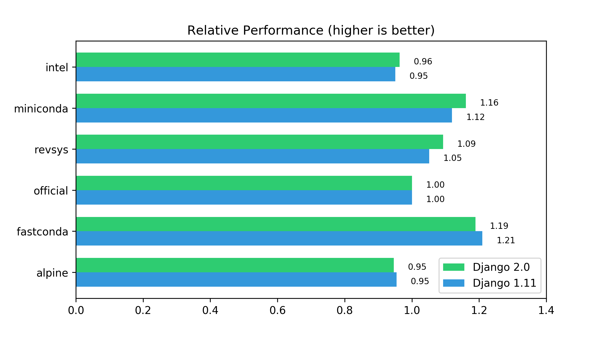

# FastConda
High performance Miniconda (Python 3) image for docker that runs ~20% faster than the official image

## TL;DR

It is a docker image that runs **even faster** than the ["optimized" Python builds](https://github.com/revsys/optimized-python-docker). Use [red8012/fastconda](https://hub.docker.com/r/red8012/fastconda/) as a replacement to the official Python image or Miniconda image.

## How?

To achieve better performance over stock image, one can

1. Enable PGO and LTO
2. Use a base image with system-level optimizations

The first point is already [covered](https://github.com/ContinuumIO/anaconda-issues/issues/423) by Anaconda, we don't have to build it ourselves. For the second point, [Clear Linux](https://clearlinux.org) seems to be a decent choice, as it is well-optimized by Intel and shows pretty [promising benchmark numbers](https://www.phoronix.com/scan.php?page=article&item=ec2-holiday-2017) compared to other Linux distributions.

## Getting Started

To run it directly:

```bash
docker pull red8012/fastconda
docker run -it red8012/fastconda /bin/bash
```

To use it in your image, replace `FROM python:latest` with `FROM red8012/fastconda:latest ` in your dockerfile.

## Benchmark

To run the benchmark, execute the following command.

```bash
wget https://github.com/red8012/FastConda/raw/master/benchmark.sh && bash benchmark.sh
```

[Djangobench](https://github.com/django/djangobench) was chosen because it is closer to the way "normal people" using Python with mixed workload. Here is the result of 6-way benchmark of different Python images.

### Competitors 

* [Intel Distribution for Python](https://software.intel.com/en-us/articles/docker-images-for-intel-python)
* [Miniconda](https://hub.docker.com/r/continuumio/miniconda3/)
* [REVSYS Optimized Python](https://www.revsys.com/tidbits/optimized-python/)
* [Official Python Images](https://hub.docker.com/_/python/) (including Alpine tag)

### Result



Note: I ran this benchmark on [dply](https://dply.co)'s free 2-hour VM, which is essentially a $5 droplet from DigitalOcean (1 vCPU, 512 MB memory, CoreOS Container Linux).  Although I ran it multiple times and took the average, it seems that the result is not very stable (possibly caused by the noisy neighbors of the VM). You can run benchmark in a well-controlled environment to get an idea of how this image perform on your system. 

### Conclusion

* FastConda image is the fastest (at least in this Djangobench benchmark). 
* Miniconda is also a good performer. 
* Revsys build is good, but not very impressive.
* Intel image seems NOT optimized for generic Python workload. Use it only if you are doing intensive numerical computation (e.g. in NumPy or Scikit-Learn).
* Use Alpine image if size is more concerned than performance.
* Use official image if you have compatibility issues.

## Image Size

Not the smallest one, but still way smaller than the official image...

| REPOSITORY                    | TAG                     | SIZE      |
| ----------------------------- | ----------------------- | --------- |
| python                        | 3-alpine                | 92.1MB    |
| revolutionsystems/python      | 3.6.3-wee-optimized-lto | 226MB     |
| **red8012/fastconda**         | **latest**              | **371MB** |
| continuumio/miniconda3        | latest                  | 571MB     |
| python                        | 3                       | 692MB     |
| intelpython/intelpython3_core | 2018.0.1                | 2.06GB    |

## Trouble Shooting Guide

Because Clear Linux is a pretty lean distribution, some package in Ubuntu images might be absent. If you run into weird problem that probably caused by some missing system packages, adding the [python-basic-dev](https://github.com/clearlinux/clr-bundles/tree/master/bundles/python-basic-dev) bundle to your dockerfile might resolve the issue. This is not included in this image to avoid size bloat.

```
# add the following line to your dockerfile
RUN swupd bundle-add python-basic-dev
```

## Contributing

If you have any advice to make Python run faster or any issue with the image, feel free to open an issue.

